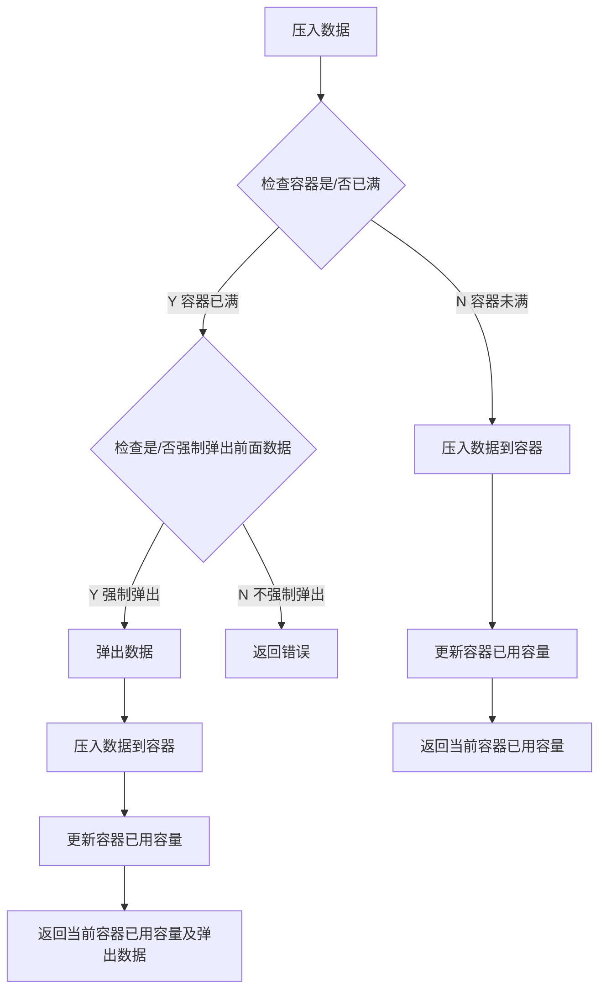
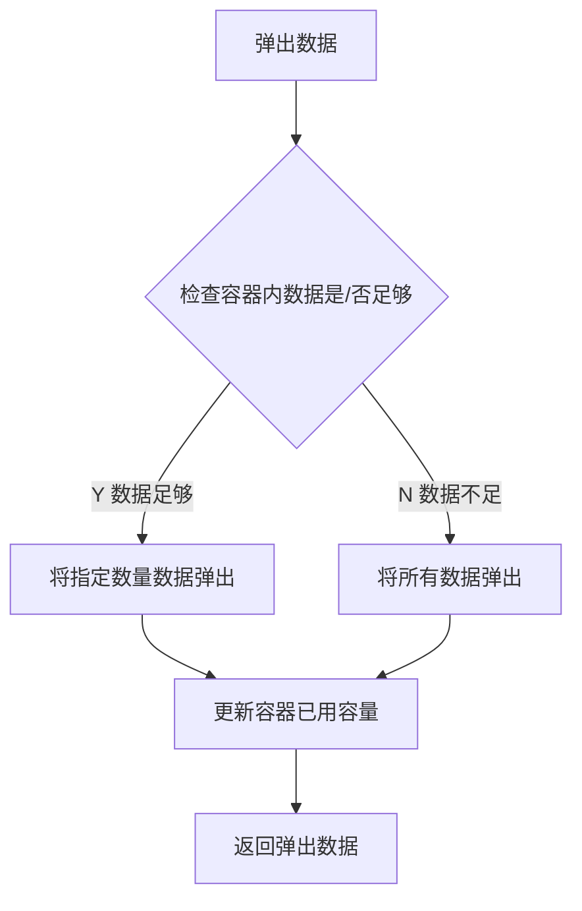
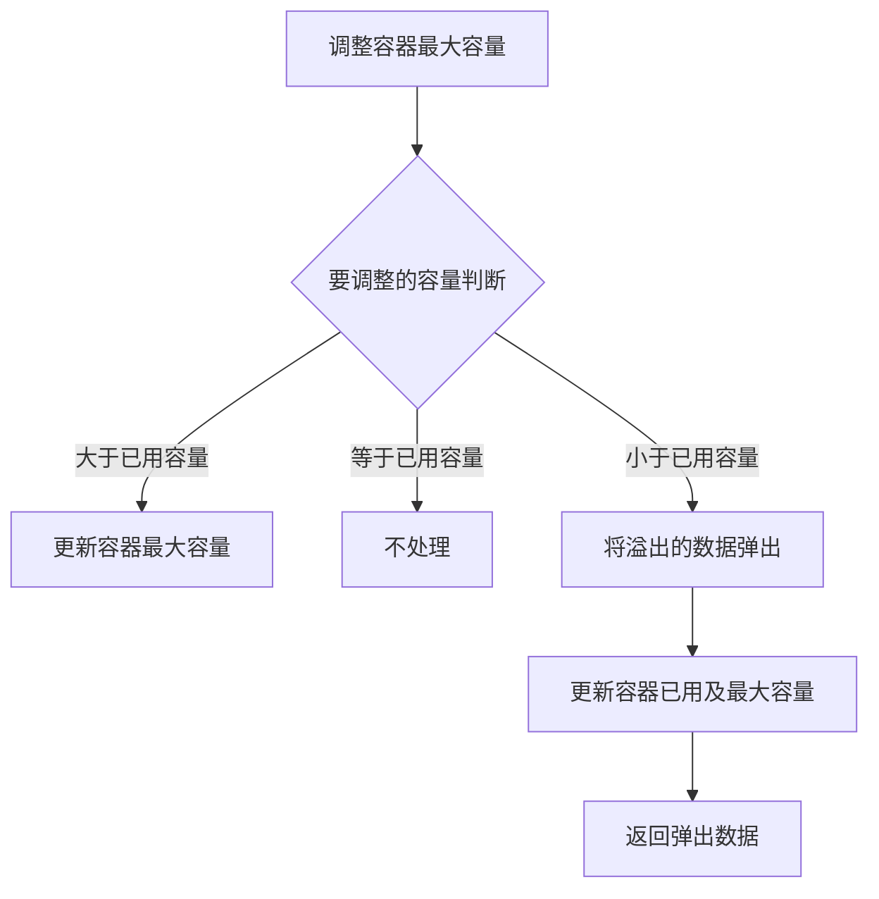

# php-redis-bucket
php 基于redis实现bucket类<br><br>

## 1. 介绍

php基于Redis实现Bucket类，Redis的 `List` 类型适合做先入先出的容器逻辑。因此，基于Redis List来创建`Bucket`类。类中使用了共享锁及Redis事务，保证并发执行的唯一性。

---

## 2. 实现的功能及处理流程

### 2.1 初始化

初始化bucket List数据，bucket已用容量，bucket最大容量。

---

### 2.2 压入数据



---

### 2.3 弹出数据



---

### 2.4 调整容器最大容量



---

## 3. 调用

### 3.1 创建对象实例

构造函数

```php
public function __construct($config, $bucket)
```

参数说明

参数 | 说明
--|--
config | redis连接设置
bucket | bucket名称（唯一）

调用例子

```php
// redis连接设定
$config = array(
    'host' => 'localhost',
    'port' => 6379,
    'index' => 0,
    'auth' => '',
    'timeout' => 1,
    'reserved' => NULL,
    'retry_interval' => 100,
);

$bucket = 'mybucket';

$oRedisBucket = new RedisBucket($config, $bucket);
```

---

### 3.2 初始化

方法

```php
public function init()
```

将队列清空，最大容量，已用容量为0

---

### 3.3 压入数据

方法

```php
public function push($data, $is_force_pop=0)
```

请求参数

参数 | 说明
--|--
data | 压入的数据(string)
is_force_pop | 是否强制弹出数据（已满的情况），默认不弹出

返回格式

```php
Array
(
    [error] => 0
    [data] => Array
        (
            [used_size] => 1
            [force_pop_data] => Array
                (
                )

        )

)
```

返回格式`（强制弹出）`

```php
Array
(
    [error] => 0
    [data] => Array
        (
            [used_size] => 3
            [force_pop_data] => Array
                (
                    [0] => a
                )

        )

)
```

---

### 3.4 弹出数据

方法

```php
public function pop($num=1)
```

请求参数

参数 | 说明
--|--
num | 弹出数据数量

返回格式

```php
Array
(
    [error] => 0
    [data] => Array
        (
            [0] => b
            [1] => c
            [2] => d
        )

)
```

---

### 3.5 设置最大容量

方法

```php
public function set_max_size($size)
```

请求参数

参数 | 说明
--|--
size | 最大容量

返回格式

```php
Array
(
    [error] => 0
    [data] => Array
        (
        )

)
```

返回格式`（强制弹出）`

```php
Array
(
    [error] => 0
    [data] => Array
        (
            [0] => e
        )

)
```

---

### 3.6 获取最大容量

方法

```php
public function get_max_size()
```

返回格式

```php
1
```

---

### 3.7 获取已用容量

方法

```php
public function get_used_size()
```

返回格式

```php
1
```

---

### 3.8 设置锁过期时间（毫秒）

方法

```php
public function set_lock_timeout($lock_timeout)
```

请求参数

参数 | 说明
--|--
lock_timeout | 锁过期时间（毫秒）

返回格式

```php
bool(true)
```

---

### 3.9 设置执行超时时间（毫秒）

方法

```php
public function set_timeout($timeout)
```

请求参数

参数 | 说明
--|--
timeout | 执行超时时间（毫秒）

返回格式

```php
bool(true)
```

---

### 3.10 设置重试间隔时间（毫秒）

方法

```php
public function set_retry_time($time)
```

请求参数

参数 | 说明
--|--
time | 重试间隔时间（毫秒）

返回格式

```php
bool(true)
```

---

## 4. 演示及测试

```php
<?php
Require 'RedisBucket.class.php';

// redis连接设定
$config = array(
    'host' => 'localhost',
    'port' => 6379,
    'index' => 0,
    'auth' => '',
    'timeout' => 1,
    'reserved' => NULL,
    'retry_interval' => 100,
);

// 创建bucket对象
$oRedisBucket = new RedisBucket($config, 'bucket');

// 初始化
$oRedisBucket->init();

// 设置最大容量
$oRedisBucket->set_max_size(3);

// 设置锁超时时间
$oRedisBucket->set_lock_timeout(300);

// 设置执行超时时间
$oRedisBucket->set_timeout(2000);

// 设置重试间隔时间
$oRedisBucket->set_retry_time(10);

// 压入3条数据
$result = $oRedisBucket->push('a');
print_r($result);

$result = $oRedisBucket->push('b');
print_r($result);

$result = $oRedisBucket->push('c');
print_r($result);

// 查看已使用容量及最大容量
var_dump(assert($oRedisBucket->get_used_size()==3));
var_dump(assert($oRedisBucket->get_max_size()==3));

// 压入1条数据，不强制弹出，容器已满
$result = $oRedisBucket->push('d');
print_r($result);

// 压入1条数据，强制弹出
$result = $oRedisBucket->push('d', 1);
print_r($result);

// 设置最大容量为5，比已用容量大，不用弹出数据
$result = $oRedisBucket->set_max_size(5);
print_r($result);

// 压入2条数据
$oRedisBucket->push('e');
$oRedisBucket->push('f');

// 查看已使用容量及最大容量
var_dump(assert($oRedisBucket->get_used_size()==5));
var_dump(assert($oRedisBucket->get_max_size()==5));

// 弹出3条数据
$result = $oRedisBucket->pop(3);
print_r($result);

// 查看已使用容量及最大容量
var_dump(assert($oRedisBucket->get_used_size()==2));
var_dump(assert($oRedisBucket->get_max_size()==5));

// 设置最大容量为1，比已用容量小，弹出数据
$result = $oRedisBucket->set_max_size(1);
print_r($result);

// 查看已使用容量及最大容量
var_dump(assert($oRedisBucket->get_used_size()==1));
var_dump(assert($oRedisBucket->get_max_size()==1));
?>
```

**输出**

```text
Array
(
    [error] => 0
    [data] => Array
        (
            [used_size] => 1
            [force_pop_data] => Array
                (
                )

        )

)
Array
(
    [error] => 0
    [data] => Array
        (
            [used_size] => 2
            [force_pop_data] => Array
                (
                )

        )

)
Array
(
    [error] => 0
    [data] => Array
        (
            [used_size] => 3
            [force_pop_data] => Array
                (
                )

        )

)
bool(true)
bool(true)
Array
(
    [error] => 1
    [data] => Array
        (
        )

)
Array
(
    [error] => 0
    [data] => Array
        (
            [used_size] => 3
            [force_pop_data] => Array
                (
                    [0] => a
                )

        )

)
Array
(
    [error] => 0
    [data] => Array
        (
        )

)
bool(true)
bool(true)
Array
(
    [error] => 0
    [data] => Array
        (
            [0] => b
            [1] => c
            [2] => d
        )

)
bool(true)
bool(true)
Array
(
    [error] => 0
    [data] => Array
        (
            [0] => e
        )

)
bool(true)
bool(true)
```

